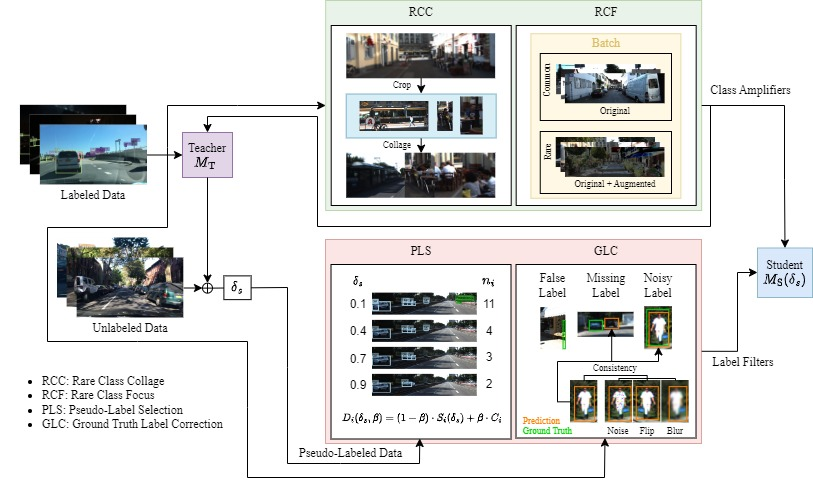

# Uncertainty-Based Auto-Labeling for Object Detection

## Table of Contents

- [Introduction](#introduction)
- [Prerequisites](#prerequisites)
- Usage of EfficientDet:
   - [Training](#training)
   - [Evaluation](#evaluation)
   - [Export](#export)
   - [Inference](#inference)
   - [Calibration](#calibration)
   - [Validation](#validation)
- Uncertainty Experiments:
   - [Decoding](#decoding)
   - [Thresholding](#thresholding)
   - [Auto-Labeling](#auto-labeling)
- Active Learning Experiments:
   - [Active Learning](#active-learning)
- Semi-Supervised Learning Experiments:
   - [Semi-Supervised Learning](#semi-supervised-learning)


- [Citations](#Citations)
- [Additional Information](#additional-information)
- [License](#License)

## Introduction
This repository provides an implementation of the following papers. It uses as a baseline detector the Keras implementation of [EfficientDet](https://github.com/google/automl/tree/master/efficientdet) exclusively for demonstration purposes.

[](https://arxiv.org/pdf/2306.08981.pdf) Overcoming the Limitations of Localization Uncertainty: Efficient & Exact Non-Linear Post-Processing and Calibration


[](https://arxiv.org/pdf/2404.17427) Cost-Sensitive Uncertainty-Based Failure Recognition for Object Detection


<a href="https://openreview.net/pdf?id=vRYt8QLKqK">
  
</a> Building Blocks for Robust and Effective Semi-Supervised Real-World Object Detection
 


[]() Link incoming, Streamlining the Development of Active Learning Methods in Object Detectiony 


## Prerequisites
1. Clone this repository, then:

   ```bash
   cd uncertainty-detection-autolabeling
   ```

2. Download via `wget` the [`EfficientDet-d0 Pre-trained Model`](https://storage.googleapis.com/cloud-tpu-checkpoints/efficientdet/coco/efficientdet-d0.tar.gz) and extract into the `src/` directory.

3. If not available, download the dataset you would like to use into the `datasets/` directory.

Then, either manually install the libraries in `requirements.txt` or:

4. Build a Docker image with the Dockerfile in the main directory. If applicable, adjust the file.

5. Run the Docker container.

## Notes
Multiple files allow the selection of which GPUs to run on, in case a selection is necessary.

For a custom dataset:
1. Place your images, labels, TFRecords in the `datasets/` directory, using the dataset name as the subdirectory.
2. Define necessary config files (eval, train, inference) in the `configs/` directory.
3. Define class labels in `src/label_util.py` for your dataset, add it to your config file in `configs/train/`.
4. Add the name of your dataset into the model name so that future analysis can directly identify it and use it for saving results, e.g., `KITTI_model1`.
5. Add the name of your dataset to the list of datasets in  `src/dataset_data.py`, in addition to all the relevant information, as inspired by the other available datasets. The config file in `configs/inference/` and `configs/eval/` needs to have the same eval/inference_{name}.yaml format. 

To test a pre-trained model on one dataset on a different dataset, follow these steps:
1. Copy the exported model in `models/exported_models/` with the dataset and model name.
2. In case of uncertainty calibration, copy the calibration folder in `results/calibration/` with the dataset and model name, containing the calibration models.
3. Rename the copied folders with the target dataset name, e.g., `KITTI_model1` to  `BDD100K_model1`.
4. Create a inference config file for the target dataset. Use the training config file of the original dataset for the hyperparameters.

The model is now ready to be tested on the new dataset. The renaming allows to keep the saved output via inference and validation under the correct dataset name.

## Training
Training the model can be achieved via two approaches.
1. Add flags to `train_runner.ini` in `configs/train/`
    - Run `src/train_runner.py`, which saves output to `src/train_results.out`.
   ```python
   python -m train_runner.py
   ```
2. Run `train_flags.py` directly using the following command:
   ```python
   python -m train_flags --train_file_pattern={train_file_pattern} --val_file_pattern={val_file_pattern} --model_name={model_name} --model_dir={model_dir} --batch_size={batch_size} --eval_samples={eval_samples} --num_epochs={num_epochs} --num_examples_per_epoch={num_examples_per_epoch} --pretrained_ckpt={pretrained_ckpt} --hparams={hparams} 
   ```

- `train_file_pattern`: Path to training TFRecord.
- `val_file_pattern`: Path to validation TFRecord.
- `model_name`: EfficientDet model name (e.g., `efficientdet-d0`, `d1`, `d2`, ...).
- `model_dir`: Model saving directory: `/app/models/trained_models/model_name`.
- `eval_samples`: Number of images in the validation set.
- `num_examples_per_epoch`: Number of images in the training set.
- `pretrained_ckpt`: Pre-trained model, e.g., `efficientdet-d0`.
- `hparams`: Path to config file, or direct model hyperparameter changes.


Models should be saved to `models/trained_models/`.

## Evaluation
Evaluating a trained model can be achieved by:
1. Defining a config file in `configs/eval`.
2. Running `src/eval.py`:
   ```python
   python -m eval.py
   ```
3. It will ask for input with the available datasets: For example, "b" to use `eval_b.yaml` and evaluate on BDD100K. It can be also given as argument directly at step 2 under `--dataset`.

## Export
Before inference, uncertainty calibration, or validation. The trained model must be exported:

1. Define a config file in `configs/inference` with:
   - `saved_model_dir`: Name of exported model. It should follow the path to `models/exported/models`
2. Run `src/inscpector.py`.
   ```python
   python -m inspector.py
   ```
3. Select which dataset and mode `0` for export. These can be also given as arguments directly at step 2 under `--dataset` and `--mode`.

## Inference
To predict on images, the exported model is required:
1. In the inference config file in `configs/inference`, edit `infer_folder` with the path to the images. A limit on the number of images can be set based on `infer_first_frame` and `infer_last_frame`.
2. Run `src/inscpector.py`.
   ```python
   python -m inspector.py
   ```
3. Select which dataset and mode `1` for inference.  These can be also given as arguments directly at step 2 under `--dataset` and `--mode`.

Output is saved to `results/inference` under a folder named after the model.

- Each image is saved n+1 times, once with the predictions, and once with every uncertainty visualized for each of the predicted uncertainties. The latter can be toggled on/off via the parameter `infer_draw_uncert`.
- A text file with the predictions on each image is also saved.

## Calibration
Calibrating the predicted uncertainty also requires an exported model. To calibrate predictions, follow these steps:
1. In the inference config file in `configs/inference`, edit val_file_pattern and eval_samples for the validation TFRecord.
2. Run `src/inscpector.py`.
   ```python
   python -m inspector.py
   ```
3. Select which dataset and mode `2` for calibration.  These can be also given as arguments directly at step 2 under `--dataset` and `--mode`.

Calibration during inference and validation can be controlled through these parameters:
- `calibrate_classification`: If enabled, it calibrates classification logits and uncertainty.
- `calib_method_class`: Choose calibration method from ["ts_all", "ts_percls", "iso_all", "iso_percls"], where "ts" stands for temperature scaling and "iso" for isotonic regression.
- `calibrate_regression`: If enabled, it calibrates localization uncertainty.
- `calib_method_box`: Choose calibration method from ["ts_all", "ts_percoo", "iso_all", "iso_percoo", "iso_perclscoo", "rel_iso_perclscoo"].

Output, including plots, metrics and calibration models, is saved to `results/calibration` under a folder named after the model.

## Validation
Similar to calibration, you can validate a model by following these steps:
1. In the inference config file in `configs/inference`, update `val_file_pattern` and `eval_samples` for the validation TFRecord.
2. Run `src/inscpector.py`.
   ```python
   python -m inspector.py
   ```
3. Select which dataset and mode `3` for validation.  These can be also given as arguments directly at step 2 under `--dataset` and `--mode`.

Output is saved to `results/validation` under a folder named after the model.
- `validate_results.txt` is saved with all ground truths and assigned predictions.
- `validationstep_runtime.txt` is saved with the mean, std and median inference time per image.
- `model_performance.txt` is saved with performance metrics based on the predictions on the validation set.
- `average_score.txt` is saved with the average score for future usage during inference as the filtering criterion of the NMS output by default.
- A folder under `aleatoric` or `epistemic` will contain an analysis with different plots and metrics of each of the localization uncertainties.

## Decoding
To compare the different decoding methods in the post-processing of the uncertainty, the parameter `uncert_adjust_method` can be changed to one of the paper's compared methods: `l-norm`, `n-flow`, `falsedec`, `sample`.

The automatic uncertainty quality analysis that is run after the prediction on the validation set will then allow to compare the performance of each method.

## Thresholding
`uncertainty_analysis.py` in `/src` includes the cost-sensitive automatic thresholding approach. It requires the model name as input, which will be added to the path of its `validate_results.txt` file, upon which the analysis is carried out. 

The model name should contain the dataset name in order to import the corresponding attributes.
```python
python -m uncertainty_analysis.py
```

The four global parameters `FPR_TPR`, `FIX_CD`, `SELECT_UNCERT` and `IOU_THRS` in the file are directly connected to `thr_fpr_tpr`, `thr_cd`, `thr_sel_uncert` and `thr_iou_thrs` in `hparams_config.py` alongside the other parameters. Therefore, the four parameters in `hparams_config.py` can be changed to perform the automatic thresholding determination for different combination of uncertainty `SELECT_UNCERT`, budget `FPR_TPR` and iou thresholds `IOU_THRS` on either correct/missing detections `FIX_CD=True` or false detections `FIX_CD=False`. Additionally, the selected uncertainties can be also changed to contain any and as many uncertainties under `selected_uncerts`, which would be optimally combined and compared to their separate usage.

The saved output contains:
- The optimal parameter for the optimized combined uncertainty under `optimal_params_{cd/fd}_{FPR_TPR}.txt`.
- Different metrics including the Jensen-Shanon divergence, the area under the ROC curve, and the proposed metrics FD@CD(b)/CD@FD(b) to compare thresholding performance between original and combined uncertainties under `thr_metrics_{cd/fd}_{FPR_TPR}.txt`. 
- Heatmaps of the uncertainty of the correctly removed, falsely kept, and falsely removed detections. Additionally, a heatmap is saved for the ground truth bounding box locations, each uncertainty, and the URMSE between the uncertainty and the residuals for the localization uncertainty. 
- Top 10 images with most correct/false removal, falsely kept detections and no removals.
- A spider plot with different metrics based on all detections compared to post-thresholding.


## Auto-Labeling
To perform auto-labeling, you first need to validate the model, see [Validation](#validation). Then, follow these steps:
1. In the inference config file in `configs/inference`, update `infer_first_frame`, `infer_last_frame` and `infer_folder`. The model will take the frames between the defined first and last and run inference on them.
2. Run `src/inscpector.py`.
   ```python
   python -m inspector.py
   ```
3. Select which dataset and mode `5` for auto-labeling. These can be also given as arguments directly at step 2 under `--dataset` and `--mode`.

If [Thresholding](#thresholding) is ran in advance, it will use the optimal parameters, given `thr_fpr_tpr`, `thr_cd`, `thr_sel_uncert` and `thr_iou_thrs` in `hparams_config.py` are the same. Otherwise it will automatically run the optimization for the current parameters.

Output is saved to `results/inference/auto_labeling` under a folder named after the model and contains:
- `prediction_data.txt` is saved with predictions.
- `examine` is a folder containing the images requiring further analysis, as they are not considered auto-labeled due to filtered detections.
- `labeled` is a folder containing the auto-labeled images, which passed the uncertainty thresholding test.

`uncertainty_ep_vs_al.py` is an additional script for uncertainty analysis with epistemic vs aleatoric.

## Active Learning

Active learning (AL) query iterations including TFRecord generation, training, inference, and selection are carried out via `active_learning_loop.py`.

Possible options: 
 - Standard scoring strategies include `random`, `entropy`, `mcbox`, `albox` and `mcclass` or any score in the prediction file of the model.
 - Training setup:
   - `baseline`: Model without uncertainty.
   - `lossatt`: Model with Loss Attenuation only.
   
   Otherwise by default it uses Loss Attenuation + MC Dropout.
 - Class balancing:
   - `perc`: Uses a weight matrix based on the distribution of the classes in the predictions combined with AL selection metric.
 - Calibrated uncertainty:
   - `calib`: Uses iso_percls_coo for localization uncertainty or iso_percls for class uncertainty/entropy.
   
   For uncalibrated just use the strategy name as is, i.e, `entropy`. 
 - Localization uncertainty:
   - `norm`: Relativize localization uncertainty.
   - `box`: Necessary to signal that it is a localization uncertainty, i.e., albox, mcbox.
 - Hashing-based methods:
   - `prune`: Removes images then adjusts the iteration budget to still match the original one in order to compare at the same 5%, 10%, etc.
   - `full_prune`: Removes images then trains once on the rest of the pool.
 - Aggregation strategy:
   - `bottomk`: Selects bottom-k uncertainty
   - `nee`: Balance exploration and exploitation in the binned score values, as per *Roy, S., Unmesh, A., Namboodiri, V.P.: Deep active learning for object detection.
   
   Otherwise top-k is default.
- Aggregation strategy per image:
   - `mean`: Selects based on mean score per image.
   
   Otherwise max is default.

All the above can be combined, and require a main scoring strategy such as `entropy`, `mcclass`, `mcbox`, `albox`, or a combination via:  
   - `combo`: Uses the optimally combined uncertainty via cost-sensitive thresholding appraoch.
   - `ental`: Uses entropy + aleatoric box uncertainty with sum after minmax scaling.
   - `alluncert`: Uses epistemic class + epistemic box + aleatoric box uncertainty with sum after minmax scaling.
   - `highep_lowal`: Uses epistemic (class + box) - aleatoric (box) after minmax scaling.
   - `epuncert`: Uses epistemic class + epistemic box uncertainty with sum after minmax scaling.
   - `sota`: Uses max uncertainty out of all uncertainties after standardization, as per *Choi, J., Elezi, I., Lee, H.J., Farabet, C., Alvarez, J.M.: Active learning for deep object detection via probabilistic modeling.
   
Note 1: The combination of the options is achieved by stacking them in the strategy name.  Uncertainty, i.e., entropy, albox, mcclass must always be the last option in the name: "___entropy".

Note 2: For faster warm-up, run `entropy` first so the other scoring strategies can use the same warm-up model and predictions.

To pre-estimate the performance of a selected AL set or increase the reliability of the evaluation set via the similarity approach, use `active_learning_eval.py`. 

For that, define in `__init__` the necessary model and TFRecord paths. 

Possible options:
 - 3 datasets with 4 variants: `KITTI`, `BDD`, `kCODA` (KITTI-CODA), `bCODA` (BDD-CODA).
 - `performance` is enabled by default, the similarity and its correlation with performance are analyzed.

   Otherwise the similarity and its correlation with evaluation reliability are analyzed.

   - `train` is disabled by default, the evaluation set is considered as the reference set.

     Otherwise the reference set is the whole pool.

Both AL files allow the selection of a different reference path to their location in case of specific remote implementations.

## Semi-Supervised Learning
This repository contains implementations of Semi-Supervised Learning (SSL) approaches for object detection, including pseudo-labels- and consistency-based methods.

The main focus is on pseudo-labels, which includes a simple student-teacher approach inspired by Sohn, Kihyuk, et al. "A simple semi-supervised learning framework for object detection." arXiv preprint arXiv:2005.04757 (2020). You can run our STAC implementation via:
```bash
python -m SSL_stac.py
```
The process consists of training, predicting, selecting, and re-training with pseudo-labels. Each batch consists of both ground truth and pseudo-labels.

The argument `selection_strategy` allows the usage of either the prediction score as per STAC or uncertainty-based approaches such as `all_uncert`, `combo`, `epuncert`, `ental`, and any other score function available in the prediction file `prediction_data.txt` in the results folder. The `selection_strategy` should include the term `pseudoscore` in addition to any added term if the pseudo-labels are to be weighted during training. For the latter, weights need to be generated via the function `_weight_generator` in `src/ssl_utils/parent.py`.

To continuously predict and retrain, include `selftrain` in the `selection_strategy`.

The argument `teacher_strategy` allows the use of one of our proposed enhancements to SSL which can be found in `src/ssl_utils` under `rcc.py` and `rcf.py`.

All the following scripts in `src/ssl_utils` depend on `parent.py`:
- **rcc.py**: Extracts crops of targeted classes and generates collages that can be used in addition to the labeled data. Include the term `rcc` in the `teacher_strategy`.
- **rcf.py**: Splits the labeled data into rare and common examples based on the class distribution in each image, ensuring the existence of rare classes in each batch. Include the term `curriculum_learning` with or without `aug`. To weight each image with a score, include the term `imscore`. For the latter, weights also need to be generated.

- **glc.py**: Cleans the ground-truth with the help of model predictions.
- **pls.py**: Sorts pseudo-labeled images based on our proposed score which correlates with missing detections.
- **3d.py**: Analyzes the effect of noise, missing detections, and false detections in pseudo-labels on training.


We also include an adaptation of Jeong, Jisoo, et al. "Consistency-based semi-supervised learning for object detection." Advances in neural information processing systems 32 (2019). To run CSD, use the following script: 
   ```python
   python -m SSL_csd.py
   ```
The argument `ratio` controls the ratio of labeled to unlabeled in each batch.

Both STAC and CSD use `train_flags_SSL.py` to run the student trainings with different arguments for each. Meanwhile the teacher is trained via the standard script `train_flags.py`.  

Citations
--------
```
@inbook{Kassem_Sbeyti_2023,
   title={Overcoming the Limitations of Localization Uncertainty: Efficient and Exact Non-linear Post-processing and Calibration},
   ISBN={9783031434242},
   ISSN={1611-3349},
   url={http://dx.doi.org/10.1007/978-3-031-43424-2_4},
   DOI={10.1007/978-3-031-43424-2_4},
   booktitle={Lecture Notes in Computer Science},
   publisher={Springer Nature Switzerland},
   author={Kassem Sbeyti, Moussa and Karg, Michelle and Wirth, Christian and Nowzad, Azarm and Albayrak, Sahin},
   year={2023},
   pages={52–68}}
```
```
@inproceedings{
   sbeyti2024costsensitive,
   title={Cost-Sensitive Uncertainty-Based Failure Recognition for Object Detection},
   author={Moussa Kassem~Sbeyti and Michelle E. Karg and Christian Wirth and Nadja Klein and Sahin Albayrak},
   booktitle={The 40th Conference on Uncertainty in Artificial Intelligence},
   year={2024}
}
```
```
@article{
   kassemsbeyti2024building,
   title={Building Blocks for Robust and Effective Semi-Supervised Real-World Object Detection},
   author={Moussa Kassem~Sbeyti and Nadja Klein and Azarm Nowzad and Fikret Sivrikaya and Sahin Albayrak},
   journal={Transactions on Machine Learning Research},
   issn={2835-8856},
   year={2025},
   url={https://openreview.net/forum?id=vRYt8QLKqK},
}
```
```
@inbook{}
```
## Additional Information
This repository uses the Keras implementation of the [EfficientDet](https://github.com/google/automl/tree/master/efficientdet) detector exclusively for demonstration purposes.
The copyright of EfficientDet is held by Google Research, 2020, and it is licensed under the Apache License, Version 2.0 (see licenses/license_apache2.txt).

This implementation serves as a practical example to showcase the results of our published papers mentioned above. 

 
## License
Copyright (C) 2024 co-pace GmbH (subsidiary of Continental AG). All rights reserved.
This repository is licensed under the BSD-3-Clause license. See [LICENSE](./LICENSE) for the full license text.